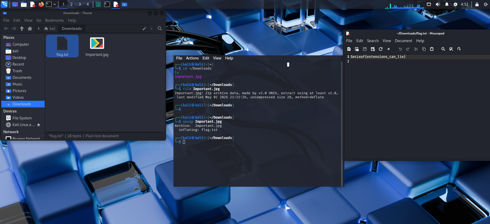

# Important – Writeup

## Challenge Description

> Some files look ordinary at first glance.  
> But sometimes the important part is hidden deeper inside.

---

# First Impressions

The challenge provided a file that looked completely normal during initial inspection.

So I started with the usual basic enumeration steps:

```bash
file <challenge_file>
```

and:

```bash
strings <challenge_file> | less
```


Nothing obvious appeared immediately.
There was no visible flag and no suspicious plaintext data.

That usually means one of a few things:
- embedded content
- hidden archives
- appended payloads
- steganography
- or nested files hidden inside another file.

At that point, the challenge started feeling more like a forensic extraction problem.

---

# Looking Deeper into the File

Since normal inspection wasn’t revealing much, I checked whether the file contained hidden internal structures using:

```bash
binwalk <challenge_file>
```

This turned out to be the key step.

`binwalk` revealed that the file actually contained additional embedded data inside it.

That matched the challenge title perfectly:
> the important part wasn’t visible on the surface.

---

# Extracting the Hidden Content

Once embedded structures were detected, I extracted them using:

```bash
binwalk -e <challenge_file>
```

This produced additional recovered files and artifacts.

I then inspected the extracted contents individually using:

```bash
file *
strings *
```

One of the recovered files finally revealed the hidden flag.

---

## Flag Captured


# The Main Idea Behind the Challenge

The challenge itself was fairly straightforward technically, but it was a good reminder of an important forensic concept:

> files are often containers for other hidden data.

Just because a file looks normal when opened normally doesn’t mean it only contains what’s visibly displayed.

Attackers and challenge authors frequently hide:
- archives
- payloads
- metadata
- or entire files

inside otherwise innocent-looking content.

---

# Tools Used

- `file`
- `strings`
- `binwalk`
- `binwalk -e`

---

# What I Learned

This challenge reinforced the importance of:
- not trusting surface-level inspection
- checking for embedded structures
- and using forensic extraction tools early.

A file that appears harmless at first glance may still contain hidden layers underneath.
